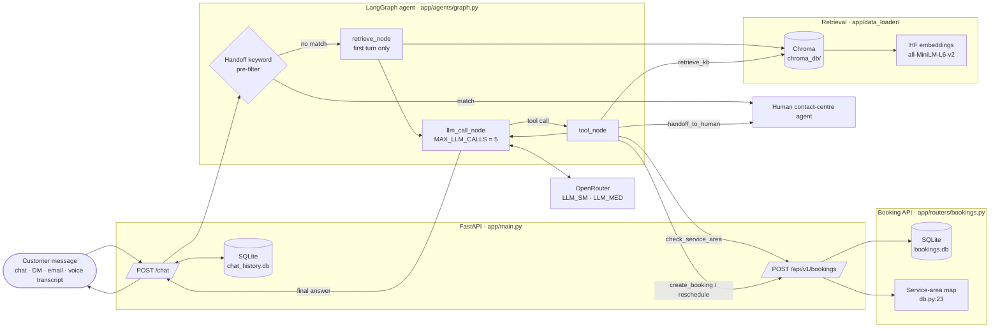

# Meridian Assistant

A retrieval-grounded, agentic customer-support prototype for Meridian Home
Services. Built as a take-home assignment per `resources/00_case_study.pdf`.

## What it does

- Answers FAQs (hours, pricing, payments, booking, emergencies, warranty) with
  inline `[source, p.X]` citations from the Meridian knowledge pack.
- Checks service-area eligibility by ZIP and trade, with branch-specific notes
  for Loudoun, Prince George's County, Alexandria, and the UMD campus.
- Creates and reschedules bookings via the mock REST API, applying
  cancellation-fee tiers and the per-customer 12-month waiver.
- Escalates to a human contact-centre agent for emergencies, commercial
  accounts, billing disputes, complaints, and low-confidence cases — with the
  full conversation attached.

## Architecture



**Flow.** A customer message hits `POST /chat`. The handoff keyword pre-filter
runs first; matches escalate immediately without an LLM call. Otherwise the
agent retrieves KB context on the first turn, then enters the LLM ↔ tool loop
(capped at 5 LLM calls). Tools hit the booking API, the vector store, or the
handoff sink. Session history is persisted in SQLite; the final answer is
streamed back to the user.

## Run it

```bash
# 1. install
uv sync

# 2. configure
cp .env.example .env
# edit .env and paste your OPENROUTER_API_KEY

# 3. build the vector store (one-time; reads data/**/*.pdf)
uv run python -c "from app.data_loader.pipeline import run_pipeline; run_pipeline()"

# 4. start the server
uv run uvicorn app.main:app --reload --port 8000

# 5. chat
curl -s -X POST http://127.0.0.1:8000/chat \
  -H 'Content-Type: application/json' \
  -d '{"message":"How much does a plumbing diagnostic cost?","session_id":"demo-1"}'
```

OpenAPI docs at `http://127.0.0.1:8000/docs`.

## Run the eval harness

```bash
# all three stages (retrieval, action, judge)
uv run python -m eval.run_eval

# skip the LLM judge (faster)
uv run python -m eval.run_eval --skip-judge

# just one stage
uv run python -m eval.run_retrieval
uv run python -m eval.run_action
uv run python -m eval.run_judge

# run with pass/fail gates disabled (collect numbers without exit-1)
uv run python -m eval.run_eval --no-gate
```

See `eval/README.md` for metrics, targets, and methodology. Latest results
in `eval/summary.md` (28/30 action cases evaluated, 2 rate-limited; all 8
handoffs triggered; judge uses `openai/gpt-4o-mini`).

## Layout

```
meridian-assistant/
├── app/
│   ├── main.py                 # FastAPI app, /chat, /health, /api/v1/bookings
│   ├── config.py               # paths, model names
│   ├── db.py                   # SQLite, ZIP coverage, booking + waiver logic
│   ├── models.py               # pydantic request/response shapes
│   ├── routers/bookings.py     # /api/v1/bookings CRUD
│   ├── data_loader/
│   │   ├── pipeline.py         # PDF -> chunks -> Chroma
│   │   ├── store.py            # Chroma + HF embeddings (cached singletons)
│   │   └── retriever.py        # similarity_search wrapper
│   └── agents/
│       ├── graph.py            # StateGraph: retrieve -> llm_call <-> tool_node
│       ├── tools.py            # 5 tools bound to the LLM
│       ├── chat_models.py      # /chat request/response shapes
│       └── support_agent/
│           ├── prompt.py       # system prompt (date-aware, citation format)
│           └── agent.py        # model binding + prompt formatter
├── eval/
│   ├── test_set.json           # 30 cases
│   ├── run_retrieval.py        # deterministic, no LLM
│   ├── run_action.py           # live agent vs expected_action + DB check
│   ├── run_judge.py            # LLM-as-judge (grounded/correct/cited)
│   ├── run_eval.py             # orchestrator -> summary.md
│   ├── README.md
│   └── results/                # JSON outputs + summary.md
├── data/                       # PDFs (gitignored for chroma_db, kept for sources)
│   ├── faqs/                   # 09, 10, 11
│   ├── pricing/                # 03, 04, 05
│   ├── service-areas/          # 01, 02
│   ├── tnc/                    # 06, 07
│   ├── _eval_data/             # 13 (test cases — excluded from KB)
│   ├── bookings.db             # SQLite mock
│   ├── chat_history.db         # /chat session memory
│   └── chroma_db/              # vector store (gitignored)
├── pyproject.toml
├── .env.example
├── production_note.md          # path-to-production memo
└── README.md
```

## Design decisions

| Decision | Why |
|---|---|
| **LangGraph** | A graph-based agent loop keeps routing, retries, and termination explicit. ReAct-style tool use without it gets messy fast. |
| **Chroma + local HF embeddings** | No external accounts, no data leaving the box, runs offline. `all-MiniLM-L6-v2` is small enough for the 13-doc corpus. |
| **OpenRouter** | Reviewers run with any model they have a key for. Swap `DEFAULT_LLM_SM` / `DEFAULT_LLM_MED` to test other models without code changes. |
| **Retrieve-on-first-turn node + `retrieve_kb` tool** | The node guarantees a citation-backed answer for the initial message; the tool lets the agent pull more context for follow-ups. |
| **In-process tool calls to `db.py`** | Avoids a self-HTTP loop. The FastAPI router still exists and is independently testable. |
| **Explicit `handoff_to_human` tool** | The LLM says it will hand off but doesn't always call the tool. The tool-call signal is the ground truth for handoff metrics. |
| **Pydantic models everywhere** | Catches malformed payloads at the boundary. The booking schema mirrors the booking API contract in `12_booking_api_spec.pdf`. |
| **SQLite, not in-memory dict** | The brief calls for a mock Booking API; SQLite gives persistence and a real query surface for the agent's `verify_booking_against_db` check. |
| **Action eval calls the agent in-process, not via HTTP** | Faster, deterministic enough for the smoke-test set, same graph that backs `/chat`. Trade-off: misses transport bugs. |
| **No framework (pydantic-evals, deepeval, etc.)** | Plain `pytest` / `python eval/run_eval.py` is enough at this scope. Production migration to DeepEval is in `production_note.md`. |

## Deliberately left out

- **Streamlit UI.** `/chat` is curl-able.
- **Docker / docker-compose.** `uv run` is enough for the prototype.
- **DigitalOcean deploy.** Out of scope for the prototype; prod plan is in `production_note.md`.
- **Authentication / rate limiting.** Sessions are identified by `session_id`; API auth is in `production_note.md`.
- **Persistent agent memory beyond session.** Sessions are in SQLite; no past-session summarisation.
- **PII masking.** Production concern; `production_note.md` covers it.
- **Vector store rebuild on push.** Pipeline is a manual one-liner; CI is in `production_note.md`.

## Known issues / follow-ups

- **30 cases is small.** Statistically meaningful thresholds need 200+. Stratified by intent, but per-class n is 1–2.
- **Date arithmetic in the prompt.** The agent gets a `Current date:` line, but the model still occasionally misinterprets it. Hardening idea: serve a tiny `today()` tool instead of injecting text.
- **Judge retrieves fresh context at eval time.** The KB chunks may differ from what the agent saw during the conversation, causing minor scoring drift.

## How to debug

```bash
# Is the server up?
curl http://127.0.0.1:8000/health

# Is the LLM reachable?
curl http://127.0.0.1:8000/llm-health

# Inspect a booking
sqlite3 data/bookings.db "SELECT * FROM bookings ORDER BY id DESC LIMIT 5;"

# Inspect a chat session
sqlite3 data/chat_history.db "SELECT * FROM messages WHERE session_id='demo-1';"
```
